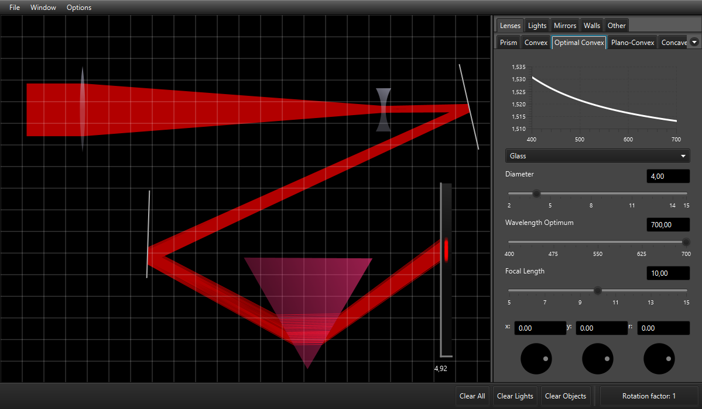

# Open Optics Module

Open source optics software created for Lund University, for questions contact sellecksamuel@gmail.com



### Download

The latest build of Open Optics Module can be found at https://openopticsmodule.com/download.
### About

Open Optics Module was developed from a need for simpler and more intuitive software for explaining simple geometrical optics in the course Waves and Optics at Lund University. The project has since developed into a number of branches, all of wich can be found at https://openopticsmodule.com.

### Configuration 
A file config.txt needs to exist in the same directory as the programs jar
file for it to successfully launch. It should look something like this:

```txt
Screen properties:
width=1200
height=700

Light Properties:
minwavelength=400
maxwavelength=700
defaultwavelength=700
maxcolorraycount=10

Interaction:
propertytextfields=true
maxobjectsizecm=15

Performance callibration:
opticsobjectresolution=300
maxraybounce=10

Admin:
admin=false
```


